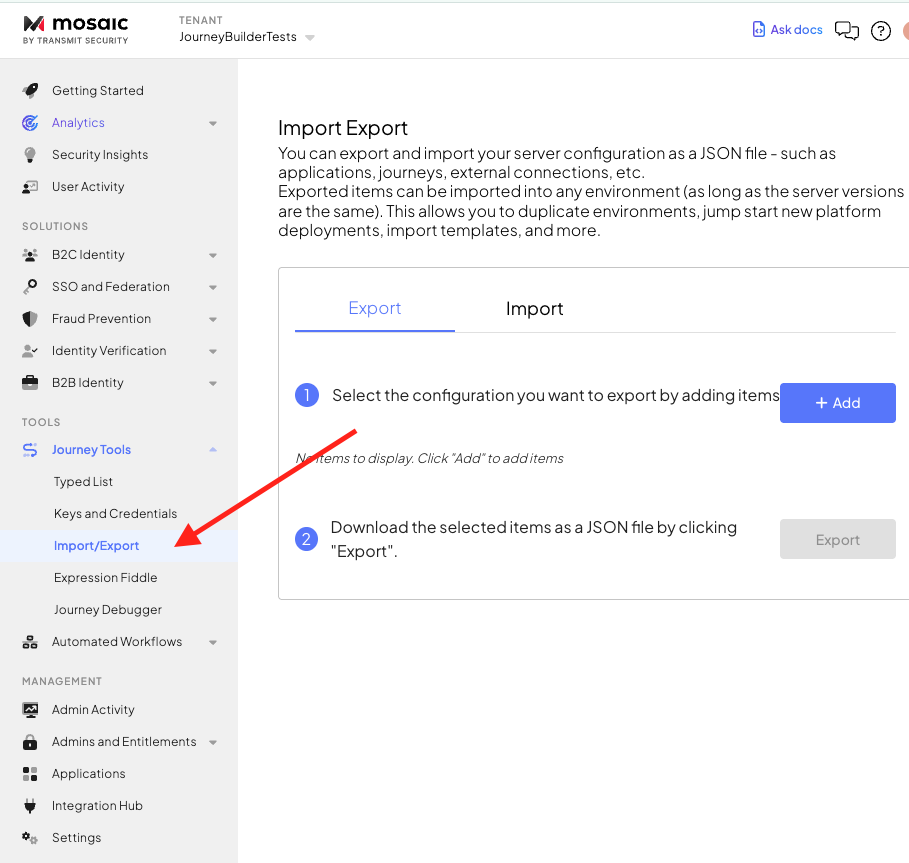
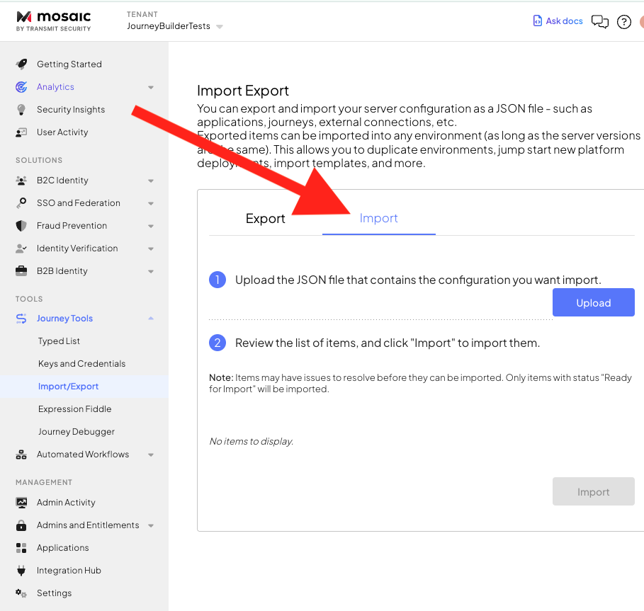
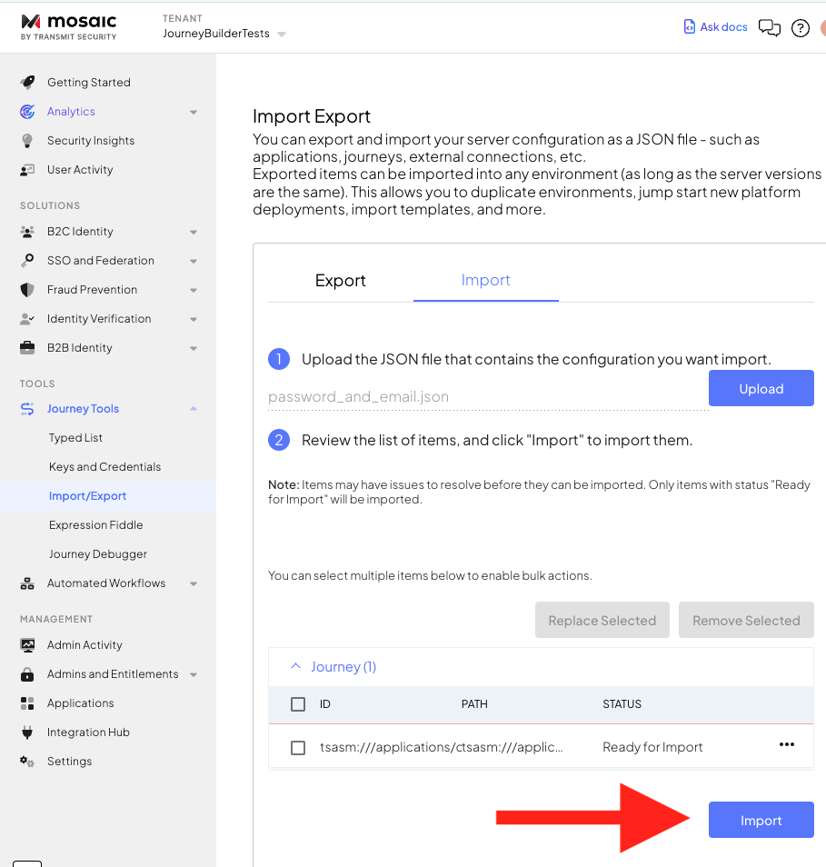
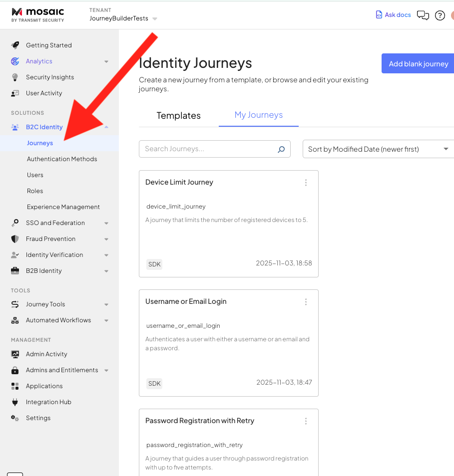

# Transmit Security IDO Journey Builder for Gemini CLI

A [Gemini CLI](https://geminicli.com/) extension that enables AI-assisted generation of [Transmit Security Identity Orchestration (IDO) Journey](https://developer.transmitsecurity.com/guides/orchestration/getting-started/journey101/) JSON configurations. Leverages the [Model Context Protocol (MCP)](https://modelcontextprotocol.io/introduction) to provide comprehensive context, validation tools, and automated fixes for creating production-ready authentication and identity workflows.

## Overview

This extension transforms Gemini CLI into an expert IDO Journey architect by providing:

1. **Comprehensive Context**: Journey generation instructions, node definitions, patterns, and best practices loaded into every session
2. **Validation Tools**: Eight specialized MCP tools for validating journey structure, metadata, expressions, variables, and required fields
3. **Working Examples**: On-demand access to complete working journey examples (loops, authentication, password reset, registration)
4. **Automated Fixes**: Auto-correction of common journey issues including UUID format, timestamps, field initialization, and more
5. **JSON Output**: Generates complete, importable journey JSON files ready for Transmit Security's Mosaic platform

### What are IDO Journeys?

Identity Orchestration (IDO) Journeys are workflow definitions for authentication and identity management flows in Transmit Security's Mosaic platform. They define:

- **Authentication flows**: Password login, passkey authentication, multi-factor authentication (MFA)
- **Registration flows**: User signup, credential enrollment, email/phone verification
- **Account management**: Password reset, credential management, profile updates
- **Risk-based flows**: Conditional authentication, step-up authentication, fraud detection integration

The [Mosaic platform](https://developer.transmitsecurity.com/) is Transmit Security's unified identity management solution that combines identity, fraud prevention, and verification services with drag-and-drop journey design tools and AI-driven security measures.

## Features

- **AI-Guided Generation**: Gemini uses extensive context to generate valid, importable journey JSON matching platform requirements
- **Working Examples On-Demand**: Access complete working journey examples only when needed, reducing context overhead by 50%
- **Multi-Layer Validation**: Six specialized validators checking structure, metadata, expressions, variables, and required fields
- **Automated Corrections**: Common issues (UUID format, timestamps, field initialization) are automatically fixed
- **Platform Integration**: Generated journeys can be imported into Transmit Security's Mosaic platform

## Prerequisites

1. **Python 3**: Required for validation scripts
   - Verify installation: `python3 --version`
   - Download from [python.org](https://www.python.org/downloads/) if needed

2. **Node.js**: Required for the MCP server
   - Verify installation: `node --version`
   - Download from [nodejs.org](https://nodejs.org/) if needed

3. **Gemini CLI**: Install the Gemini CLI tool
   - Follow the installation guide at [https://geminicli.com/](https://geminicli.com/)

## Installation

Install the extension using the Gemini CLI:

```bash
gemini extensions install https://github.com/TransmitSecurity/ts_ido_journey_builder_gemini_cli_extension
```

After installation, install the required npm packages for the MCP server:

```bash
cd ~/.gemini/extensions/ts-ido-journey-builder/mcp
npm install
```

If Gemini CLI is already running, restart it after installation.

## Configuration

The extension is configured via `gemini-extension.json`:

```json
{
  "name": "ts-ido-journey-builder",
  "version": "1.0.0",
  "contextFileName": "instructions.md",
  "mcpServers": {
    "journey-tools": {
      "command": "node",
      "args": ["${extensionPath}${/}mcp${/}server.js"],
      "env": {
        "WORKSPACE_FOLDER": "${workspaceFolder}",
        "EXTENSION_PATH": "${extensionPath}"
      }
    }
  },
  "excludeTools": [
    "run_shell_command(gemini)"
  ]
}
```

**Key Configuration Elements:**

- `contextFileName`: Points to `instructions.md` - the comprehensive instruction set loaded into every Gemini session
- `mcpServers`: Defines the Node.js MCP server that exposes validation and fixing tools
- `excludeTools`: Security restriction to prevent certain command executions

## Usage

Once installed, start the Gemini CLI:

```bash
gemini
```

The extension automatically loads `instructions.md` context, making Gemini an expert in IDO Journey generation.

### Example: Generate a Password Login Journey

```
You: Create a simple password authentication journey with email login

Gemini: [Uses instructions.md context to understand:]
        - Required journey structure with exports array
        - Proper UUID format (hexadecimal only)
        - login_form node with password escape link
        - transmit_platform_password_authentication node
        - auth_pass terminal node
        - All required metadata and timestamps
        
        [Generates complete journey JSON]
        [Saves to file]
        [Automatically runs journey_fixes tool]
        [Runs validation tools to verify correctness]
        [Returns validated, importable <journey>.json]
```

### Example: Generate MFA Journey

```
You: Create an MFA journey with password and TOTP authentication

Gemini: [Generates journey with:]
        - login_form node with password escape link
        - Password authentication node
        - Conditional check for TOTP enrollment
        - TOTP authentication node
        - Registration flow for new TOTP users
        - Proper variable management throughout
        
        [Validates and fixes automatically]
```

### Importing to Mosaic Platform

Once your journey JSON is generated and validated:

1. Open Transmit Security's Mosaic platform
2. Navigate to Tools > Journey Tools > Import/Export



3. Select the Import tab, and then Upload to choose the file



4. Once the file is uploaded press the Import button



5. Navigate to Solutions > B2C Identity  > Journeys and select the just imported Journey to review and deploy it



## Available Tools

The extension provides eight MCP tools accessible during journey generation:

### 1. `journey_fixes`
Performs common auto-fixes after generation. **Always run first after generating a journey.**


**Input:** 
- `journey_json_path`: Path to the journey JSON file

### 2. `validate_journey_metadata`
Checks journey-level metadata: type, version_id, state, timestamps.

**Input:** 
- `journey_json_path`: Path to the journey JSON file

### 3. `validate_journey_structure`
Validates structural integrity and reachability.

**Validates:**
- UUID formats (node IDs, workflow ID)
- All nodes reachable from head node
- Proper loop and block nesting
- Link structure completeness
- No orphaned nodes

**Input:** 
- `journey_json_path`: Path to the journey JSON file

### 4. `validate_journey_required_fields`
Checks that all required fields are present for each node type.

**Validates:**
- Platform node required fields (user_identifier, password, etc.)
- Action node required fields (text, button_text, etc.)
- Form schema structure
- Condition node structure
- JSON data format

**Input:** 
- `journey_json_path`: Path to the journey JSON file

### 5. `validate_journey_expressions`
Validates expression syntax and formatting.

**Validates:**
- Template literal syntax (backticks, ${} interpolation)
- Expression escaping (quotes inside backticks)
- AuthScript-style rules compliance
- Loop and condition expressions

**Input:** 
- `journey_json_path`: Path to the journey JSON file

### 6. `validate_journey_variables`
Checks variable definition and usage.

**Validates:**
- Variables defined before use
- Proper variable scoping in loops
- Variable initialization structure
- Field access matches initialization

**Input:** 
- `journey_json_path`: Path to the journey JSON file

### 7. `stringify_json_field`
Stringifies JSON schema and inserts it into fields requiring stringified JSON with literal `\n` and `\"`.

**Use Cases:**
- `action/form_schema/value` in `get_information` nodes
- `links/N/data_json_schema/value` in `login_form` escape links

**Input:**
- `json_path`: Path to the JSON file to stringify
- `journey_json_path`: Path to the journey JSON file
- `field_name`: Field path starting with NODE_ID (e.g., `node-abc-123/action/form_schema/value`)

### 8. `display_journey_examples`
Displays complete working journey examples with explanations and JSON. Provides on-demand access to reference patterns without loading all examples into context.

**Available Patterns:**
- `loop`: Password authentication retry loop (up to 5 attempts) with phone deregistration
- `email_otp_authentication`: Email OTP authentication with username lookup and email verification
- `password_reset`: Email OTP password reset with optional passkey registration
- `registration`: Complete registration with risk assessment, IDV, device and passkey setup
- `all`: Display all available examples

**Input:**
- `pattern`: The type of example to display (one of the patterns above)
- `include_explanation`: (Optional) Whether to include explanations (default: true). Set to false for JSON only.

**Example Usage:**
```javascript
display_journey_examples({ pattern: "loop" })
display_journey_examples({ pattern: "registration", include_explanation: false })
```

## Journey Generation Context

The extension provides comprehensive context through `instructions.md` 

### Content Includes

- **Node Type Catalog**: Definitions for 70+ node types with required fields, examples, and patterns
- **Expression Syntax**: Template literals, @std functions, variable access patterns
- **Variable Management**: Initialization patterns, scoping rules, field access
- **Link Types**: Proper usage of `child`, `escape`, `error`, and `conditional` links
- **Complete Journey Structure**: Required exports array format, metadata fields, constraints
- **Common Patterns**: Authentication flows, registration flows, conditional logic, loops, forms
- **Working Examples**: Complete journey examples accessible on-demand via `display_journey_examples` tool
- **Error Prevention**: Common mistakes and how to avoid them

## Extension Structure

```
gemini_cli_extension/
├── README.md                         # This file
├── images/                           # Images used for this file
├── LICENSE                           # Apache 2.0 License
├── gemini-extension.json             # Extension configuration
├── instructions.md                   # Comprehensive instructions (50% smaller!)
└── mcp/                              # MCP server and validators
    ├── package.json                  # Node.js dependencies
    ├── server.js                     # Node.js MCP server
    ├── security_validator.py         # Security validation module
    ├── journey_fixes.py              # Auto-fix common issues
    ├── journey_validator_base.py     # Base validator class
    ├── validate_journey_metadata.py  # Metadata validator
    ├── validate_journey_structure.py # Structure validator
    ├── validate_journey_required_fields.py # Required fields validator
    ├── validate_journey_expressions.py # Expression syntax validator
    ├── validate_journey_variables.py # Variable usage validator
    ├── stringify_json_field.py       # JSON stringification tool
    ├── node_definitions.json         # Node type definitions
    └── examples/                     # Working journey examples
        ├── loop_example.md
        ├── email_otp_authentication_example.md
        ├── password_reset_example.md
        └── registration_with_protection_example.md
```

## Development

### Running the MCP Server Standalone

```bash
cd mcp
node server.js
```

### Testing Validators Directly

If you wish, it is possible to run the validation scripts manually on a journey json file:

```bash
cd mcp
python3 journey_fixes.py /path/to/journey.json
python3 validate_journey_metadata.py /path/to/journey.json
python3 validate_journey_structure.py /path/to/journey.json
# ... etc
```

### Modifying Generation Instructions

Edit `instructions.md` to update:
- Node type patterns and examples
- Generation rules and best practices
- Expression syntax guidelines
- Variable management patterns

Changes take effect on next Gemini CLI session.

### Adding New Validators

1. Create new Python script in `mcp/` directory inheriting from `JourneyValidatorBase`
2. Add tool definition in `server.js` `ListToolsRequestSchema` handler
3. Add script mapping in `validator_scripts` object
4. Add handler in `CallToolRequestSchema`
5. Update this README

### Extending Node Definitions

Edit `mcp/node_definitions.json` to add or update node type definitions. The validators use this file to check required fields for each node type.

## Troubleshooting

### Common Issues

**MCP Server Connection Failed**

If the extension fails to connect, the MCP server is missing npm dependencies:

```bash
cd ~/.gemini/extensions/ts-ido-journey-builder/mcp
npm install
```

Then restart Gemini CLI.

**Validation Issues**

- Ensure Python 3 is installed and available as `python3`
- Check that journey JSON file path is correct and readable
- Review specific validation error messages


## Security

This extension implements multiple security layers to protect your workspace:

### Built-in Security Features

1. **Path Validation**: All file operations are restricted to allowed directories:
   - Your current working directory (where you invoked `gemini`)
   - The extension workspace folder
   - Path traversal attacks (e.g., `../../../etc/passwd`) are blocked

2. **File Type Restrictions**: Only `.json` files can be accessed or modified by the extension tools.

3. **File Size Limits**: Files are limited to 10MB to prevent resource exhaustion attacks.

4. **Input Sanitization**: All user inputs are validated and sanitized to prevent injection attacks.

5. **Error Message Sanitization**: Error messages do not expose full filesystem paths, only filenames.

6. **Command Restrictions**: The extension excludes `run_shell_command` to prevent arbitrary command execution.

### Usage Guidelines

> **Local Development Only**: This extension is designed for local development. The MCP server runs locally and only accesses files within your workspace.

> **Review Generated Code**: Always review generated journey configurations before deploying to production. Ensure they align with your organization's security and compliance requirements.

> **Platform Validation**: Transmit Security's Mosaic platform performs additional validation during journey import. Generated JSON must pass both this extension's validation and the platform's import checks.

## About Transmit Security

[Transmit Security](https://transmitsecurity.com/) provides a unified identity and fraud prevention platform. The Mosaic platform enables organizations to design customer identity journeys using visual tools, natural language prompts, and AI-driven security measures. It combines:

- **Identity Management**: Authentication, authorization, session management
- **Fraud Prevention**: Risk-based authentication, behavioral analytics, bot detection
- **Identity Verification**: Document verification, biometric authentication, liveness detection

For more information, visit the [Transmit Security Developer Documentation](https://developer.transmitsecurity.com/guides/orchestration).

## License

Apache License 2.0 - See [LICENSE](LICENSE) file for details.

Copyright © 2025 Transmit Security

## Support

For issues, questions, or contributions:

- **Bug Reports**: Create an issue in the project repository
- **Documentation**: Consult the [Transmit Security Documentation](https://developer.transmitsecurity.com/guides/orchestration) for comprehensive journey generation guidance
- **Platform Issues**: Contact Transmit Security support for Mosaic platform questions

## Related Resources

- [Transmit Security Documentation](https://developer.transmitsecurity.com/guides/orchestration)
- [IDO Journey Overview](https://developer.transmitsecurity.com/guides/orchestration/journeys)
- [Model Context Protocol](https://modelcontextprotocol.io/introduction)
- [Gemini CLI Documentation](https://geminicli.com/docs/extensions/)

---

**Version:** 1.0.0  
**Last Updated:** November 2025

> **Note:** This extension is an independent project designed to facilitate IDO Journey generation for Transmit Security's platform. It is not officially affiliated with or endorsed by Transmit Security.
